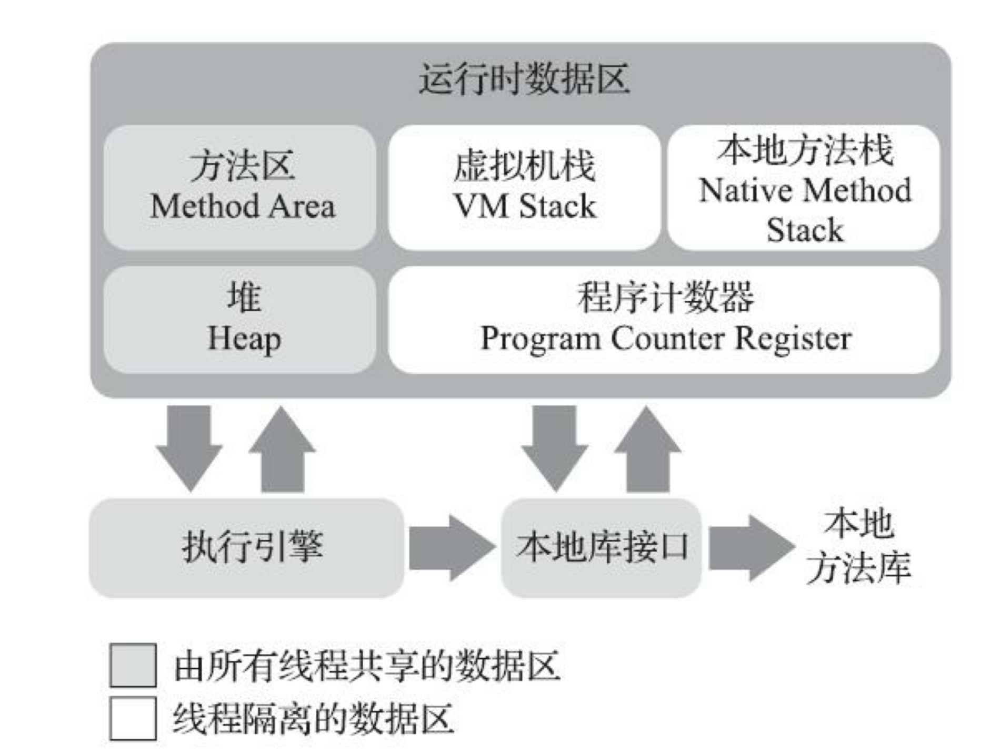

# JAVA
* [JDK](#Java-Development-Kit)
* [Java Virtual Machine(JVM)](#Java-Virtual-Machine)
  * [What is Java Virtual Machine](#What-is-Java_Virtual_Machine-?)
  * [Volatile](#Volatile)

---
## Jave Development Kit
### JDK
> JDK 是用于支持Java程序开发的最小环境   

Java 程序设计语言   
Java 虚拟机   
Java类库

### JRE (Java Runtime Environment) 
>JRE 是支持Java程序运行的标准环境   

Java 虚拟机   
Java类库中的Java API SE

---

## Java Virtual Machine
### What is Java Virtual Machine?
Java Virtual Machine (JVM) is a engine that provides runtime environment to drive the Java Code or applications. It converts Java bytecode into machines language. JVM is a part of Java Run Environment (JRE). In other programming languages, the compiler produces machine code for a particular system. However, Java compiler produces code for a Virtual Machine known as Java Virtual Machine.

- JVM is the one that actually calls the main method present in a java code. 

Java applications are called WORA (Write Once Run Anywhere). This means a programmer can develop Java code on one system and can expect it to run on any other Java enabled system without any adjustment. This is all possible because of JVM.

When we compile a .java file, .class files(contains byte-code) with the same class names present in .java file are generated by the Java compiler. This .class file goes into various steps when we run it. These steps together describe the whole JVM.

### How JVM works?
- First, Java code is complied into bytecode. This bytecode gets interpreted on different machines
- Between host system and Java source, Bytecode is an intermediary language.
- JVM is responsible for allocating memory space.

### JVM Architecture
It contains classloader, memory area, execution engine etc.

#### 程序计数器(Program Counter Register)   
程序计数器是一块较小的内存空间，它可以看作是当前线程所执行的字节码的信号指示器。在Java虚拟机的概念模型里，字节码解释器工作时就是通过改变这个计数器的值来选取下一条需要执行的字节码指令。   

由于Java虚拟机的多线程是通过线程轮流切换、分配处理器执行时间的方式来实现的。在任何一个确定的时刻，一个处理器（对于多核处理器来说是一个内核）都只会执行一条线程中的指令。因此，为了线程切换后能恢复到正确的执行位置，**每条线程都需要一个独立的程序计数器，各线程之间计数器互不影响，独立存储，我们称这类内存区域为“线程私有”内存**。   

如果线程正在执行的是一个Java方法，这个计数器记录的是正在执行的虚拟机字节码指令的地址.   
如果线程正在执行的是一个本地（Native）方法，这个计数器的值则为Undefined。   
(此内存区域是唯一一个在《Java虚拟机规范》中没有规定任何OutOfMemoryError情况的区域)   

#### Java虚拟机栈(Java Virtual Machine Stack)
Java Virtual Machine Stack也是线程私有的，他的生命周期与线程相同。虚拟机栈描述的是Java方法执行的线程内存模型；每个方法被执行的时候，Java虚拟机都会同步创建一个Stack Frame 用于存储**局部变量表**，操作数栈，动态连接，方法出口等信息。每一个方法被调用直至执行完毕的过程，就是对应着一个这Stack Frame在虚拟机栈中从入栈到出栈的过程。
- 局部变量表存放了编译期可知的各种Java虚拟机基本数据类型（boolean, byte, char, short, int, float, long, double)、对象饮用(reference 类型，它并不等同于对象本身，可能是一个指向对象起始地址的引用指针，也可能是指向一个代表对象的句柄或者其他与对象相关的位置)和returenAddress类型（指向了一条字节码指令的地址）。  
- 这些数据类型在局部变量表中的以Slot来表示，其中64位长度的long和double类型的数据会占用两个slot，其余的数据类型只占用一个。**局部变量表所需的内存空间在编译期间完成分配，当进入一个方法时，一个方法需要在stack frame里分配多大的局部变量空间是完全确定的，在方法运行期间不会改变局部变量表的大小**。（“大小”指slot的数量，虚拟机真正使用多大的内存空间来实现一个slot完全是虚拟机实现自行决定的）   

在《Java虚拟机规范》中，对这个内存区域规定了两类异常状况：
- 如果线程请求的深度大于虚拟机所允许的深度，将抛出StackOverFlowError异常
- 如果Java虚拟机栈（stack）容量可以动态扩展，当栈扩展时无法申请到足够的内存会抛出OutOfMemoryError异常   

#### 本地方法栈(Native Method Stacks)
本地方法栈与虚拟机栈所发挥的作用是非常相似的，区别只是虚拟机执行Java方法(字节码)服务，而本地方法栈则是为虚拟机使用到的本地(Native) 方法服务。

#### Java堆(Heap)
Java Heap是虚拟机所管理的内存中最大的一块。**Java Heap是被所有线程共享的一块内存区域，在虚拟机启动时创建。此内存区域的唯一目的就是存放对象实例，Java世界里，“几乎”所有的对象实例都放在这里分配内存。**   
Java Heap也是垃圾收集器管理的内存区域，因此一些资料中它也被称为“GC堆”(Garbage Collected Heap)。   
从分配内存的角度来看，所有线程共享的Java Heap中可以划分出多个线程私有的分配缓冲区(Thread Local Allocation Buffer, TLAB)，以提升对象分配时的效率。
>根据《Java虚拟机规范》，Java Heap可以处于物理上不连续的内存空间中，但在逻辑上它应该被视为连续的。但对于大对象(典型的如数组对象)，多数虚拟机处于实现简单和存储高效考虑，很可能会要求连续的内存空间。   

Java Heap可以被设置成
- 固体大小
- 可拓展   

**当前主流的Java虚拟机都是按照可拓展**。如果在Java Heap中没有内存完成实例分配，并且也无法再拓展时，将会抛出OutOfMemoryError异常。

#### 方法区(Method Area\ Non-Heap)
方法区与Java Heap一样，是各个线程共享的内存区域。它用于存储已经被虚拟机加载的类型信息、常量、静态变量、即时编译器编译后的代码缓存等数据。
> 运行时常量池(Runtime Constant Pool) 是方法区的一部分。Class文件中除了有类的版本、字段、方法、接口等描述信息外，还有一项信息是常量池表(Constant Pool Table)，用于存放编译气生成的各种字面量与符号引用。这部分内容将在类加载后存放在方法区的运行时常量池中。   
运行时常量池相对于Class文件中的常量池的一个重要特征是具备动态性。Java语言并不要求常量一定只有编译期才能产生，并非一定要预置入Class文件中的常量池才能进入方法区运行时常量池，运行期间也可以将新的常量放入池中，比如String类的intern()。当常量池无法在申请到内存时会抛出OutOfMemoryError异常。

---

### Java Object 对象的创建   
在语言层面上，创建对象通常仅仅是一个new关键字而已，而在虚拟机中，Java对象的创建又是怎么样的过程呢？   

当Java虚拟机遇到一个字节码new指令时   
- 先检查这个指令的参数是否能在常量池中定位到一个类的符号引用
- 检查这个符号引用代表的类是否已经被加载、解析和初始化过
- 如果没有，必须先执行相应的类加载过程

接下来，虚拟机将为新生对象分配内存。对象所需要的内存大小在类加载完成后就可以完全确定了，等同于把一块确定大小的内存块从Java堆中划分出来。
> 假设Java堆的内存是绝对规整的(所有被使用的内存在一边，空闲的内存在另一边，中间用指针作为分界)， 那分配就是把指针向空闲空间方向挪动一段与对象大小相等的距离，this is called 指针碰撞(Bump The Pointer)。   

> 假设Java堆的内存并不是规整的，虚拟机就需要维护一个列表，记录哪些内存是可用的，在分配的时候从列表上找到一块足够大的空间划分给对象，并更新列表上的记录，this is called 空闲列表(Free List)。

Java堆是否规整是垃圾收集器是否带有空间压缩整理(Compact)的能力决定。   

需要考虑的问题是，修改一个指针指向的位置，在并发情况下并不是线程安全的。可能出现正在给对象A分配内存,指针还没来得及修改,对象B又同时使用了原来的指针来分配内存的情况。
> 解决方法一： 对分配内存空间的动作进行同步处理-CAS配上失败重试的方法保证更新操作的原子性。

> 解决方案二： 把内存分配的动作按照线程划分在不同的空间之中操作，即每个线程在Java堆中预先分配一小块内存，called 本地线程分配缓冲(Thread LOcal Allocation Buffer, TLAB)，哪个线程要分配内存，就在那个线程的本地缓冲区分配，只有本地缓冲区用完了，分配新的缓冲区才需要同步锁定。

**内存分配完成后，虚拟机必须将分配到的内存空间都初始化为零值。**
Java虚拟机需要对对象进行必要的设置，例如是哪个类的实例，如何找到类的元数据信息，对象的哈希码，将这些信息放在对象的对象头里(Object Header)。

在虚拟机的角度，一个新的对象已经产生了。但是从Java程序的角度来说，对象的创建才刚刚开始，Class文件的<init>()方法还没有执行，需要执行init()按照程员的意向对对象进行初始化。

---

## Volatile
### Why use volatile?
Using volatile is yet another way (like synchronized, atomic wrapper) of making class thread safe. Thread safe means that a method or class instance can be used by multiple threads at the same time without any problem.

### 特性
- 1.可见性/visible。对一个volatile变量的读，总是能看到（任意线程）对这个volatile变量最后的写入。
- 2.原子性/atomic。对任意单个volatile变量的读/写具有原子性，但类似于volatile++这种复合操作不具有原子性。

</img>

### volatile vs static
Note that volatile should not be confused with static modifier.   
static variables are class members that are shared among all objects. There is only one copy of them in main memory.

### volatile vs synchronized
Before we move on let’s take a look at two important features of locks and synchronization.   
- 1.Mutual Exclusion: It means that only one thread or process can execute a block of code (critical section) at a time.
- 2.Visibility: It means that changes made by one thread to shared data are visible to other threads.

Java’s synchronized keyword guarantees both mutual exclusion and visibility.   
- If we make the blocks of threads that modifies the value of shared variable synchronized only one thread can enter the block and changes made by it will be reflected in the main memory.   
All other thread trying to enter the block at the same time will be blocked and put to sleep.

In some cases we may only desire the visibility and not atomicity. Use of synchronized in such situation is an overkill and may cause scalability problems. Here volatile comes to the rescue.   
- Volatile variables have the visibility features of synchronized but not the atomicity features.   
The values of volatile variable will never be cached and all writes and reads will be done to and from the main memory.    

However, use of volatile is limited to very restricted set of cases as most of the times atomicity is desired.   
- For example a simple increment statement such as x = x + 1; or x++ seems to be a single operation but is s really a compound read-modify-write sequence of operations that must execute atomically.

### volatile write
当写一个volatile变量时，JMM会把该线程对应的本地中的共享变量值刷新到主内存。

